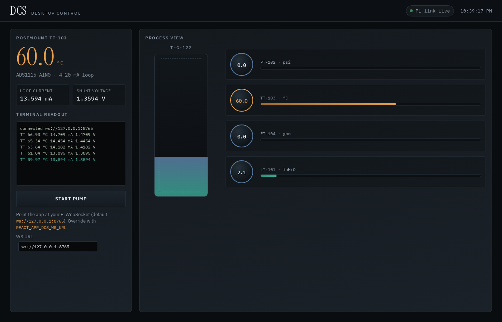
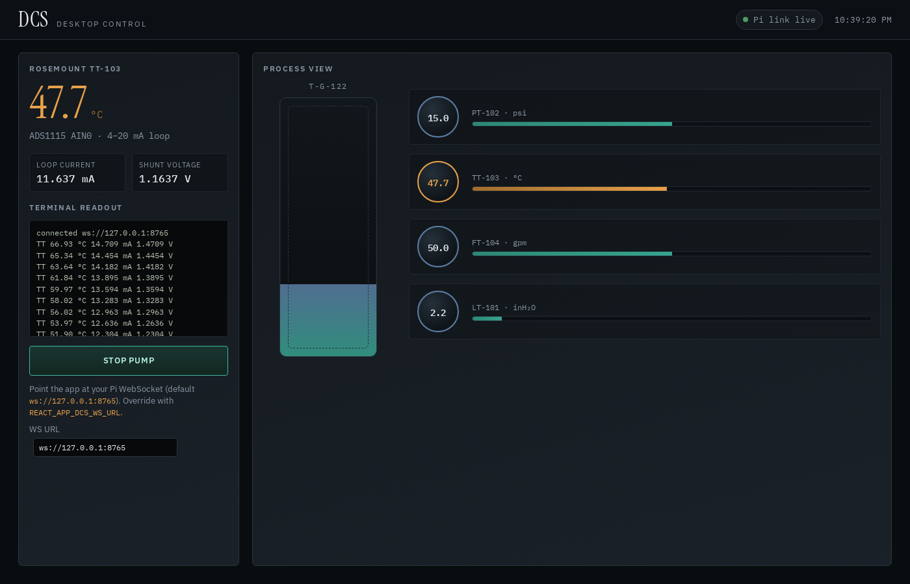
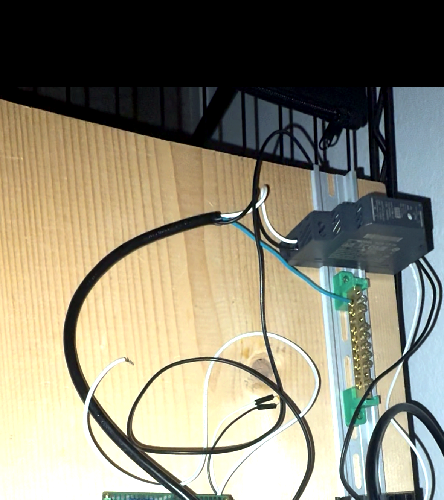
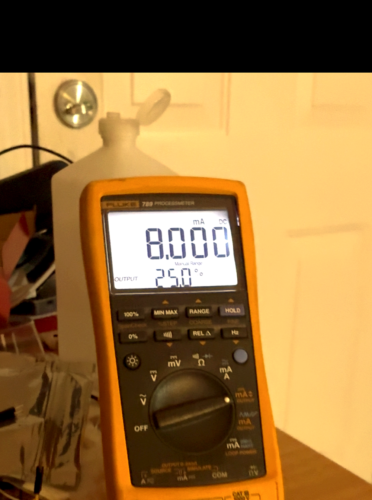
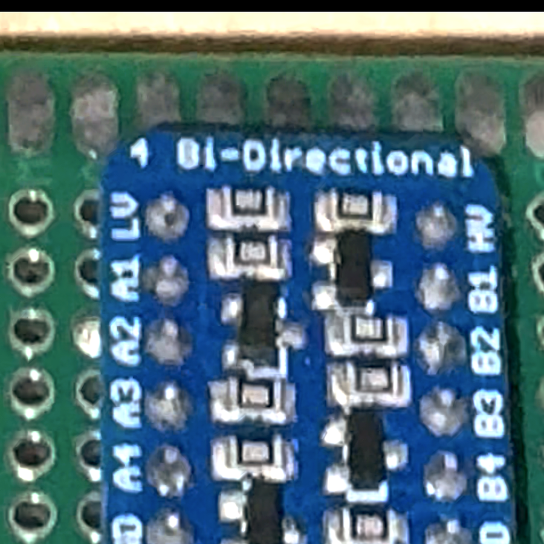
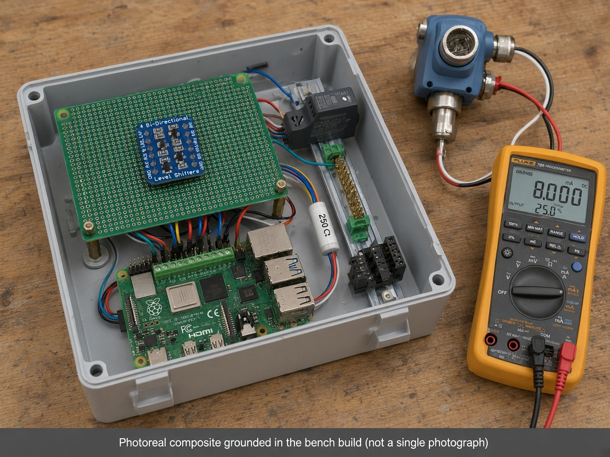

# DCS — Desktop Control System

Personal portfolio project: a **Raspberry Pi 4** reads a **Rosemount temperature transmitter** through an **ADS1115** (I²C, via a blue 4-channel level shifter on a green perfboard HAT), prints live values in the terminal, and streams them to an **Electron** desktop app over the LAN.

Built and verified on real hardware. Bench terminal math shows a **250 Ω** shunt (≈1–5 V for 4–20 mA). Anyone with a Pi and the parts below can reproduce it.

---

## Desktop app

Live Rosemount TT-103 readout (demo / simulator link) and pump control:





---

## Bench photos (real)

Assembled stack on wood — Pi 4, GPIO screw terminals, green perfboard HAT, blue **4 Bi-Directional Level Shifters**, Mean Well on DIN rail, brass ground bar, DIN terminal blocks:



*Photo of the bench build (lightly exposure/sharpen cleaned).*

Fluke 789 ProcessMeter sourcing **8.000 mA / 25.0%** into the loop during checkout:



*Photo (lightly cleaned).*

Blue level-shifter module on the green perfboard:



*Photo (lightly cleaned).*

### Photoreal composite (grounded in that build)

Same internals arranged in an open enclosure with a Rosemount-style transmitter on the 4–20 mA loop (and optional Fluke as test gear). **Not a single photograph** — generated to match the real parts above.



*Photoreal composite grounded in the bench build (not a single photograph).*

---

## What it measured

| Signal | Source | Path |
|---|---|---|
| Process temperature (°C) | Rosemount 2-wire transmitter | 4–20 mA → **250 Ω** shunt → ADS1115 AIN0 → Pi |
| Loop current (mA) / shunt voltage (V) / % span | Same ADC sample | Converted in `raspberry-pi/dcs_server.py` |

Default scale: **4 mA → 0 °C**, **20 mA → 100 °C** (match your transmitter’s LRV/URV).  
Shunt: **250 Ω** → **1.0 V @ 4 mA**, **5.0 V @ 20 mA** (ADS at 5 V; I²C level-shifted to the Pi).

Terminal stream on the bench looked like:

```text
V=2.001 V  I=8.02 mA  %Span=25.1%
V=3.002 V  I=12.03 mA  %Span=50.2%
```

---

## How the Pi and desktop talk

```
[ Rosemount TT ] --4–20 mA--> [ 250 Ω shunt + ADS1115 @ 5 V ]
                                    |
                         I²C via 4-ch level shifter
                                    |
                            [ Raspberry Pi 4 ]
                            dcs_server.py
                               |      |
                          terminal   WebSocket :8765
                                         |
                                   [ Desktop app ]
                                      Electron
```

- **On the Pi:** `python3 dcs_server.py` samples the ADS1115, prints `V` / `I` / `%Span` (and TT) to the terminal, and serves `ws://0.0.0.0:8765`.
- **On the desktop:** the Electron app connects to `ws://<pi-ip>:8765`, shows TT-103, loop current, shunt voltage, and a scrolling terminal-style log.
- **Without hardware:** run `simulator/` on your laptop — same JSON protocol — and point the app at `ws://127.0.0.1:8765`.

### Why WebSocket

WebSocket is the remote HMI path: view live readings from another machine on the LAN without SSH or a serial cable. The Pi keeps sampling and printing to its own terminal even if the desktop disconnects. If the link drops, the UI goes blind (shows **Pi link lost**) and reconnects with backoff until the service is reachable again. That failure mode is expected for a LAN viewer — not a reason to force serial for remote desktop use.

Payload example:

```json
{
  "type": "reading",
  "temperature_c": 25.0,
  "voltage_v": 2.0,
  "current_ma": 8.0,
  "span_pct": 25.0,
  "pump": "off"
}
```

Optional pump commands (GPIO 17 relay): `{"command":"pump","state":"on"}`.

---

## Repository layout

```
DCS/
├── desktop-app/          # Electron + React UI
├── raspberry-pi/         # ADS1115 reader + WebSocket service
├── simulator/            # LAN-free stand-in for the Pi service
├── docs/
│   ├── hardware/         # PDF schematics + notes
│   └── images/           # App screenshots, bench photos, composite
└── README.md
```

---

## Parts / BOM

### Used on the bench (this build)

| Item | Link / notes | Role |
|---|---|---|
| Raspberry Pi 4 Model B | — | Runs `dcs_server.py` |
| Green GPIO screw-terminal breakout on Pi header | (OONO-style TB still useful: [B084C69VSQ](https://www.amazon.com/dp/B084C69VSQ)) | Field wiring to the HAT |
| Green perfboard HAT + standoffs | Hand-assembled | Carries level shifter + ADC interconnect |
| Blue **4 Bi-Directional Level Shifters** module | On the perfboard | 5 V ADS1115 I²C ↔ Pi 3.3 V |
| ADS1115 breakout | [Adafruit 1085](https://www.adafruit.com/product/1085) or equiv. | 16-bit ADC @ **5 V**, addr `0x48` |
| **250 Ω** ±0.1% shunt | — | 4–20 mA → 1–5 V |
| Mean Well DIN-rail 24 VDC PSU | [HDR-15-24 example](https://www.amazon.com/dp/B0C9C4LNR4) | Loop supply |
| DIN terminal blocks / fuse TBs | [PT 4-HESI example](https://www.amazon.com/dp/B0D59WVSKS) | Loop landing / protection |
| Brass ground bar on DIN | — | Star ground |
| Rosemount temperature transmitter | 2-wire 4–20 mA | Process input |
| Fluke 789 ProcessMeter | Test gear | mA OUTPUT checkout (e.g. 8.000 mA / 25%) |

---

## Hardware wiring

### Exact pinout

| Pi header | Signal | Goes to |
|---|---|---|
| Pin 1 (3V3) | LV power | Level shifter **LV** |
| Pin 3 (GPIO2) | SDA | Level shifter **A1** → ADS **SDA** (HV) |
| Pin 5 (GPIO3) | SCL | Level shifter **A2** → ADS **SCL** (HV) |
| Pin 6 (GND) | Ground | LLC GND + ADS GND + **shunt low** |
| Pin 11 (GPIO17) | Optional pump relay | Relay IN (active-low) |

ADS1115 **VDD = 5 V** (not Pi 3V3). **ADDR → GND** ⇒ **0x48**.

**Loop:** `+24 V` (Mean Well) → Rosemount `+` → Rosemount `−` → **shunt high (250 Ω)** → ADS1115 **AIN0**; **shunt low** → `24 V−` and ADC/Pi GND (star at the brass bar).

### Connections (wire-level, preferred for schematics)

Full netlist / pin tables for SKiDL or KiCad (Markdown):

- **[docs/hardware/CONNECTIONS.md](docs/hardware/CONNECTIONS.md)** — every confirmed connection, rails, 250 Ω shunt, LLC, ADS1115, TODOs for gaps
- **[hardware/skidl/](hardware/skidl/)** — SKiDL Python project → `out/dcs.net`, `out/bom.csv`, checklist (`python3 main.py`)

### Schematics (PDF)

GitHub does **not** inline PDF drawings in Markdown — **open the PDF files**:

- [docs/hardware/schematic-overview.pdf](docs/hardware/schematic-overview.pdf) — **SCH-DCS-001** rev C
- [docs/hardware/pinout.pdf](docs/hardware/pinout.pdf) — **SCH-DCS-002** rev C
- [docs/hardware/hardware-notes.md](docs/hardware/hardware-notes.md)

### Check the ADC

```bash
sudo raspi-config   # Interface Options → I2C → Enable
sudo apt install i2c-tools
sudo i2cdetect -y 1
# expect device at 0x48
```

---

## Run on the Raspberry Pi

```bash
cd raspberry-pi
python3 -m venv .venv
source .venv/bin/activate
pip install -r requirements.txt
python3 dcs_server.py
```

You should see a live terminal stream like:

```text
V=2.000 V  I=8.00 mA  %Span=25.0%  TT=25.00 °C  pump=off
```

Demo without the ADS1115:

```bash
python3 dcs_server.py --demo
```

Optional systemd unit: `raspberry-pi/dcs.service` (edit paths for your Pi user).

Useful env vars: `DCS_WS_PORT`, `DCS_SHUNT_OHMS` (default **250**), `DCS_LRV_C`, `DCS_URV_C`, `DCS_ADS_ADDR`, `DCS_ADC_CHANNEL`.

---

## Run the desktop app

```bash
cd desktop-app
npm install
npm start
```

This starts the React dev server and opens Electron. Set the WebSocket URL in the side panel (default `ws://127.0.0.1:8765` on localhost, or your Pi LAN IP).

Web-only (no Electron window):

```bash
npm run start:web
```

Production build:

```bash
npm run build
```

---

## Run the simulator (no Pi)

```bash
cd simulator
npm install
npm start
# ws://127.0.0.1:8765 — same protocol as the Pi service
```

Then start the desktop app and leave the WS URL at `ws://127.0.0.1:8765`.

---

## Notes

- Temperature on TT-103 comes from the Pi/simulator stream. Tank level / flow / pressure remain local process-view animation driven by the pump control (same idea as the original dashboard).
- Keep 24 V loop grounding at the shunt low / brass bar; prefer the Mean Well DIN supply for the loop.

---

## License

Personal project — no license applied. Use as inspiration; adapt the pinout to your board.
